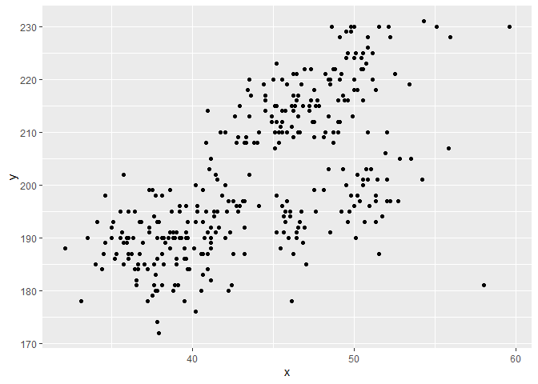

P8105 Homework 1
================
JingYao Geng

This is my solution to HW1

> Preparation:

##### Load the package ‘tidyverse’

``` r
library(tidyverse)
```

## Problem 1

##### a) Create a data frame with the specified elements

``` r
# Create and define the data frame
prob1_df = 
  tibble(
    samp = rnorm(n = 10),
    samp_gt_0 = samp > 0,
    char_vec = c("a", "b", "c", "d", "e", "f", "g", "h","i","j" ),
    factor_vec = factor(c("low", "low", "low", "mod", "mod", "mod", "mod", "high", "high", "high"))
)
# Take a look at 'prob1_df' 
prob1_df
## # A tibble: 10 x 4
##       samp samp_gt_0 char_vec factor_vec
##      <dbl> <lgl>     <chr>    <fct>     
##  1 -0.257  FALSE     a        low       
##  2 -0.0552 FALSE     b        low       
##  3 -1.52   FALSE     c        low       
##  4  0.714  TRUE      d        mod       
##  5  1.55   TRUE      e        mod       
##  6 -0.268  FALSE     f        mod       
##  7 -0.0448 FALSE     g        mod       
##  8  0.0351 TRUE      h        high      
##  9 -0.269  FALSE     i        high      
## 10 -0.536  FALSE     j        high
```

##### b) Take the mean of each variable in the data frame

``` r
# pull out the variables and take the mean for each of them

mean(pull(prob1_df, samp))        # mean of the numeric 
## [1] -0.065338

mean(pull(prob1_df, samp_gt_0))   # mean of the logical 
## [1] 0.3

mean(pull(prob1_df, char_vec))    # mean of the character 
## Warning in mean.default(pull(prob1_df, char_vec)): argument is not numeric or
## logical: returning NA
## [1] NA

mean(pull(prob1_df, factor_vec))  # mean of the factor
## Warning in mean.default(pull(prob1_df, factor_vec)): argument is not numeric or
## logical: returning NA
## [1] NA
```

I can take the mean of numbers and logical but not character or factor
variables.

##### c) Convert the logical, character, and factor variables into numeric variable

``` r
# Apply the as.numeric function

as.numeric(pull(prob1_df, samp))
as.numeric(pull(prob1_df, samp_gt_0))
as.numeric(pull(prob1_df, char_vec))
as.numeric(pull(prob1_df, factor_vec))
```

##### d) Convert the logical vector to numeric, factor, and multiply the random sample by the result

``` r
# logical -> numeric, and multiply the random sample
as.numeric(pull(prob1_df, samp_gt_0)) * pull(prob1_df, samp)
##  [1] 0.00000000 0.00000000 0.00000000 0.71351930 1.54714625 0.00000000
##  [7] 0.00000000 0.03513181 0.00000000 0.00000000

# logical -> factor, and multiply the random sample
as.factor(pull(prob1_df, samp_gt_0)) * pull(prob1_df, samp)
## Warning in Ops.factor(as.factor(pull(prob1_df, samp_gt_0)), pull(prob1_df, : '*'
## not meaningful for factors
##  [1] NA NA NA NA NA NA NA NA NA NA

# logical -> factor -> numeric, and multiply the random samp 
as.numeric(as.factor(pull(prob1_df, factor_vec))) * pull(prob1_df, samp)
##  [1] -0.51497179 -0.11030473 -3.03804485  2.14055791  4.64143874 -0.80401225
##  [7] -0.13445390  0.03513181 -0.26857171 -0.53612295
```

## Problem 2

##### a) Load the dataset: *‘penguins’*

``` r
data("penguins", package = "palmerpenguins")
print(penguins) # take a look at the dataset
## # A tibble: 344 x 8
##    species island bill_length_mm bill_depth_mm flipper_length_~ body_mass_g
##    <fct>   <fct>           <dbl>         <dbl>            <int>       <int>
##  1 Adelie  Torge~           39.1          18.7              181        3750
##  2 Adelie  Torge~           39.5          17.4              186        3800
##  3 Adelie  Torge~           40.3          18                195        3250
##  4 Adelie  Torge~           NA            NA                 NA          NA
##  5 Adelie  Torge~           36.7          19.3              193        3450
##  6 Adelie  Torge~           39.3          20.6              190        3650
##  7 Adelie  Torge~           38.9          17.8              181        3625
##  8 Adelie  Torge~           39.2          19.6              195        4675
##  9 Adelie  Torge~           34.1          18.1              193        3475
## 10 Adelie  Torge~           42            20.2              190        4250
## # ... with 334 more rows, and 2 more variables: sex <fct>, year <int>
```

  - There are **8** variables in the **penguins** dataset, they are:
    
      - **“species, island, bill\_length\_mm, bill\_depth\_mm,
        flipper\_length\_mm, body\_mass\_g, sex, year”**

  - Among all the variables,
    
      - 3 of them are factor: species, island, and sex.
      - 2 of them are doubles: bill length and bill depth.
      - 3 of them are integer: flipper length and body mass.

  - The dataset **penguins** has **344** rows and **8** columns.

  - The mean of **flipper length** is 200.9152047 .

##### b) Scatterplot of flipper\_length(y) vs. bill\_length\_mm(x)

``` r
plot_fb = tibble(
  x = penguins$bill_length_mm,
  y = penguins$flipper_length_mm
)

ggplot(plot_fb, aes(x = x, y = y)) + geom_point()
```

    ## Warning: Removed 2 rows containing missing values (geom_point).

<!-- -->
